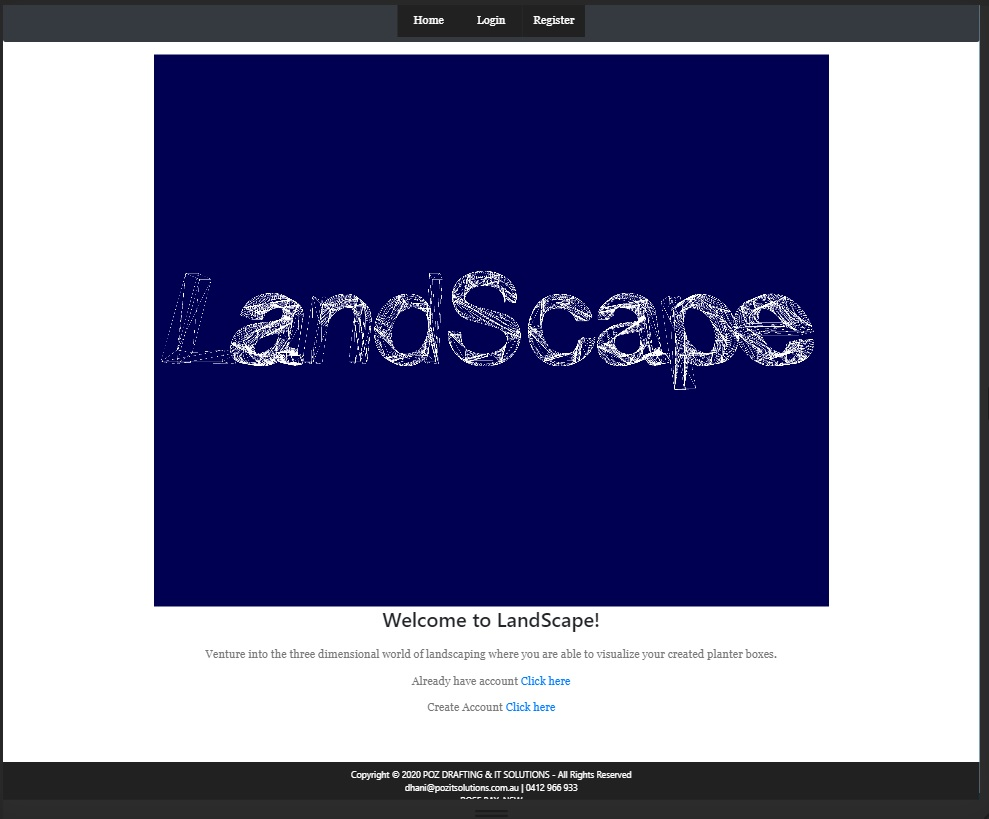

# landscapeApp

Summary

The web application ventures into the three dimensional world of landscaping where the user is able
the visualize and store created planter boxes. When opening the web application, the user will be
presented with the landing page displaying a short gif video demonstrating how the applcation is
utilized. The user is required to register an account in order to access the application. Once the
user is logged in, they are directed to their profile page. From this point the user can access the
shapeSelect page where they can choose the shape of their planter box. Then they are directed to the
calculation page where they are presented with the 3D model of the selected planter box. The user can
select from a range of materials to fill the planter box. The material data is stored in a database.
The user enters a name and the dimensions of their planter box and clicks on the 'calculate' button which
calculates the volume, required amount of material to fill the planter box and the cost. The user has the
option to change the dimensions and material until they are happy with their inputs. The user can then
click on the 'submit' button which will take the data entered and save it to a database. The user is
directed to the projects page where a list of their projects can be viewed. In order to gain access to
the details of their projects, the user has to click on their project which will send them to the details
page where the information for their planter box is displayed. The user user can add as many projects as
they want and will stay looged in until they choose to logout.

The following npm's and methods where used in the development of the backend of this application:
- express
- path
- Procfile
- get
- post
- delete
- dotenv

Getting Started

This documentation will assist you in viewing this project. To view the project either open
the url of the deployed application with the following address in any browser:

https://rocky-oasis-12776.herokuapp.com/

Download and clone the repository from GitHub using the following command:

git clone https://github.com/pozengineer/landscapeApp.git

In the terminal type in the command
npm start: To run the server.js file

This application was built using:
- HTML: HyperText Markup Language that allows the developer to describe pages
- CSS: Style Sheet Language that allows the developer to style an HTML document
- BootStrap: Library of HTML and CSS files and code https://getbootstrap.com/
- API: Application Programming Interface, which is a software intermediary that
  allows two applications to talk to each other.
- Node.js: An open-source, cross-platform, JavaScript runtime environment that
  executes JavaScript code outside of a browser.
- Express.js: An open source web application framework for Node.js
- Heroku: Is a platform as a service (PaaS) that enables developers to build, run,
  and operate applications in the cloud
- mongoDB: Is a cross-platform document-oriented database program. It uses JSON-like
  documentswith schema.
- three.js: Is a cross-browser JavaScript library and application programming interface
  (API) used to create and display animated 3D computer graphics in a web browser.

  
